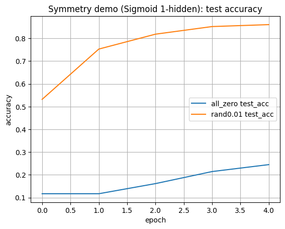
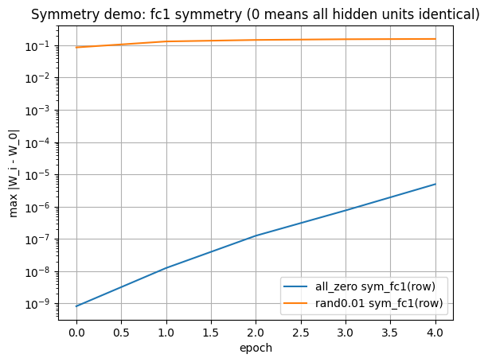
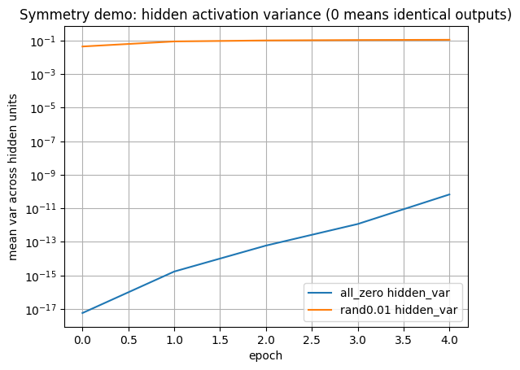
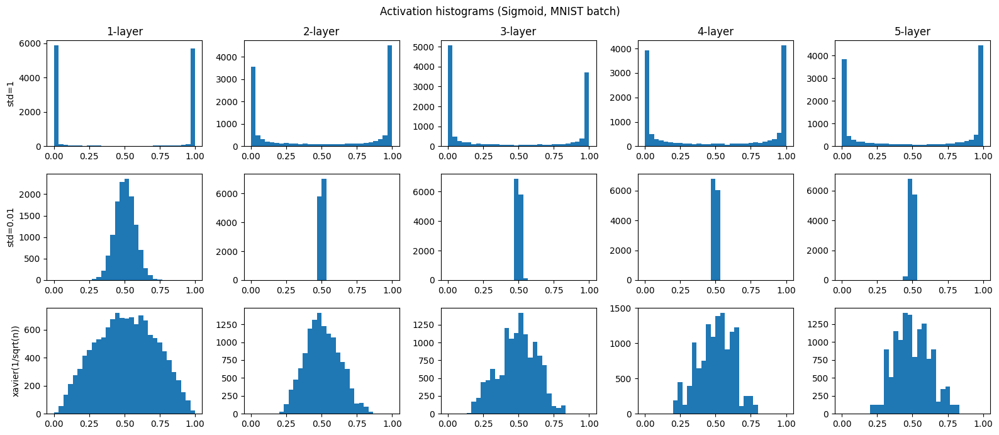
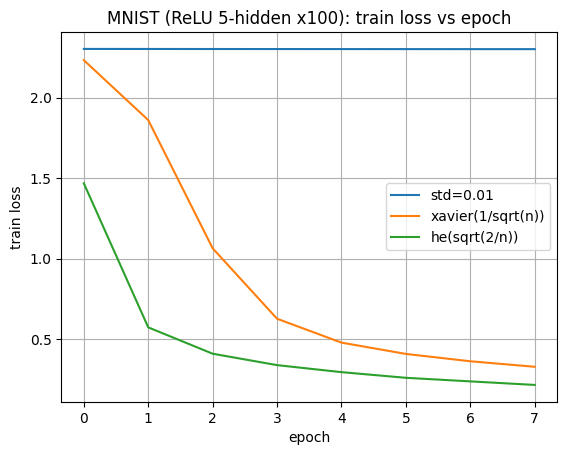
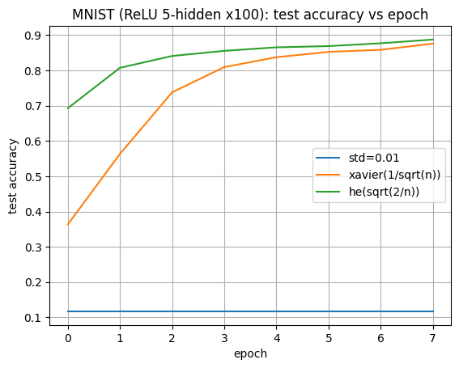

# weight-initialization-bench

MNISTを使って、重み初期化が学習・アクティベーション分布・対称性（symmetry breaking）に与える影響を検証するリポジトリである。

本リポジトリの目的は次の3点だ。

1. **重みを全て0で初期化すると対称性が崩れず**、隠れ層ユニットが実質的に同一になって「多数の重みを持つ意味」が失われることを確認する  
2. 重みスケール（std）やXavier初期値が、深いネットワークにおける**シグモイドのアクティベーション分布**をどう変えるかを可視化する  
3. MNIST実学習で **std=0.01 / Xavier / He** を比較し、学習曲線（loss/accuracy）の差を確認する  

---

## ディレクトリ構成

```text
.
├── data/          # torchvisionがダウンロードするMNIST
├── figures/       # 生成画像（保存済み）
├── mnist_init_compare.py
└── README.md
````

---

## 実行方法

依存（例）：

```bash
pip install torch torchvision matplotlib numpy
```

実行：

```bash
python mnist_init_compare.py
```

実行するとログが標準出力に出て、図が `figures/` に保存される。

---

## 今回の実行条件（ログの前提）

`mnist_init_compare.py` の設定より：

* `SEED = 0`
* `DEVICE = "cpu"`（対称性の観察のためCPU推奨）
* `TRAIN_SUBSET = 10000`
* `TEST_SUBSET  = 2000`
* 比較学習（ReLU 5-hidden x100）：`EPOCHS_COMPARE = 8`, `LR_COMPARE = 0.01`
* 対称性デモ（Sigmoid 1-hidden）：`EPOCHS_SYMM = 5`, `LR_SYMM = 0.1`, `H_SYMM = 100`

---

# 実験と図の解説

以下では **図ごと**に「何を見せているか」「どう解釈するか」を説明する。

---

## 図1: `symmetry_test_accuracy.png`

### 何をしているか

* モデル：Sigmoid 1-hidden（`784 -> 100 -> 10`）
* 比較：

  * **all_zero**：全パラメータ（重み・バイアス）を0で初期化
  * **rand0.01**：重みを `N(0, 0.01)` で初期化（バイアス0）
* 指標：MNISTテスト精度（epoch推移）

### 何が分かるか

* **all_zero** は精度がほぼ伸びず（今回ログでは `0.117 → 0.245` 程度）、学習が非常に弱い。
* **rand0.01** は初期から伸び、短いepochでも高い精度に到達（今回ログでは `0.532 → 0.861` 程度）。

### 解釈

この図だけでも「ゼロ初期化は良くない」ことは見えるが、重要なのは次の2枚（対称性指標）である。
ゼロ初期化が問題なのは、単に精度が低いからではなく、**隠れ層ユニットが同一のままになり“多数の重みを持つ意味”が消える**点にある。



---

## 図2: `symmetry_fc1.png`

### 何をしているか

* 図1と同じ「Sigmoid 1-hidden」設定
* 指標：`sym(fc1,row) = max |W_i - W_0|`

  * fc1の重み行列 `W` は形状 `(hidden_units, 784)`
  * **各行が「隠れ層ユニット1個の重みベクトル」**に対応する
  * したがって `max |W_i - W_0|` が **0に近いほど、全ユニットが同一の重み**を持つ（対称性が崩れていない）

### 何が分かるか（今回の結果）

* **all_zero**：`sym(fc1,row)` が極小のまま（ログでは `1e-10 → 1e-6` 程度）
  → 隠れ層ユニットの重みがほぼ同一であり続ける
* **rand0.01**：`sym(fc1,row)` が `~1e-1` オーダー
  → ユニット間で重みが明確に分化している

### 解釈（ここが核心）

全ゼロ初期化だと、順伝播で各ユニットに入る値が同じになりやすく、逆伝播でも各ユニットの勾配が揃う。
結果として **全ユニットが同じ更新を受け続け、重みが“対称（同一）”のまま残る**。
つまり「100ユニットある」ように見えても、中身は**同じユニットの複製**になり、表現力を増やすためにユニットを増やした意味が失われる。



---

## 図3: `symmetry_hidden_variance.png`

### 何をしているか

* 図1と同じ「Sigmoid 1-hidden」設定
* 指標：`hidden_var`

  * ミニバッチ内の各サンプルについて「隠れ層ユニット間の分散」を計算し、その平均を取る
  * **0に近いほど、各サンプルで全ユニットが同じ出力を返している**（= ユニットが同一挙動）

### 何が分かるか（今回の結果）

* **all_zero**：`hidden_var` が極小（ログでは `1e-18 → 1e-10` 程度）
  → 隠れ層の100ユニットが、実質的に同じ値を出し続けている
* **rand0.01**：`hidden_var` が `~1e-2〜1e-1`
  → ユニットが異なる出力を作っており、多様性がある

### 解釈

図2（重みの同一性）と図3（出力の同一性）がセットで、「ゼロ初期化により対称性が崩れない」ことを定量的に示す。
この状態では、極端には「隠れ層が1ユニットでも同じことができる」方向に潰れていく。



---

## 図4: `sigmoid_activation_histograms.png`

### 何をしているか

* 入力：MNISTミニバッチ（1000枚）
* 5層相当のSigmoidネットにデータを流し、各層のアクティベーション分布をヒストグラムで可視化
* 比較：

  * `std=1`
  * `std=0.01`
  * `xavier(1/sqrt(n))`

### 何が分かるか

* **std=1（最上段）**
  0付近と1付近に強く偏り、層が進んでも飽和した分布になっている。
  → Sigmoidは0/1近傍で勾配が小さいため、**勾配消失**が起きやすい。

* **std=0.01（中段）**
  0.5付近に強く集中し、層が深くなるほどさらに尖る。
  → 飽和は避けやすい一方、ユニットが似た値を出しやすく、**表現が単調**になりやすい（「表現力の制限」側の問題）。

* **Xavier（最下段）**
  0/1飽和にも0.5一点集中にも寄りにくく、相対的に「適度な広がり」を作れる。
  → 深い層でも信号が潰れにくく、学習が進みやすい方向。



---

## 図5: `compare_train_loss.png`

### 何をしているか

* MNIST学習（ReLU 5-hidden x100）
* 初期値比較：

  * `std=0.01`
  * `xavier(1/sqrt(n))`
  * `he(sqrt(2/n))`
* 指標：train loss（epoch推移）

### 何が分かるか（今回の結果）

* **std=0.01**：lossがほぼ下がらない（ログでは `2.3025 → 2.3010` 程度）
  → ほぼ学習していない。
* **Xavier**：lossが大きく低下（`2.2327 → 0.3274`）
* **He**：最も速く低下（`1.4674 → 0.2146`）

### 解釈

ReLUは負側が0になるため、スケールが小さすぎると活性が0付近に寄って学習が鈍る。
He初期値はReLU前提で分散を維持しやすく、今回の設定でも最も学習が速い。



---

## 図6: `compare_test_accuracy.png`

### 何をしているか

* 図5と同じ学習のテスト精度（epoch推移）

### 何が分かるか（今回の結果）

* **std=0.01**：精度がランダム推測相当（約0.1付近）に張り付き

  * ログでは全epochで `test_acc = 0.117`
* **Xavier**：`0.363 → 0.876`
* **He**：`0.693 → 0.887`（立ち上がりが速い）

### 解釈（結論）

* ReLUネットでは、**std=0.01 のように小さすぎる初期値**は学習を止めやすい（少なくとも著しく遅くする）。
* **XavierとHe**は学習が進むが、ReLUでは特に **He初期値がベストプラクティス**になりやすいことが、学習曲線として確認できる。



---

## 補足: ReLUの「全ゼロ初期化」チェックについて

ログ末尾の

```text
[ReLU all-zero stuck] ... grad_L1sum=2.34e-01
```

は「勾配が完全にゼロ」という意味ではない。全ゼロ初期化では、ReLUを挟んだ隠れ層側は勾配が流れにくい一方、**最終層のバイアス**など一部パラメータには勾配が出るため、勾配和（L1sum）は0にならないことがある。
しかし学習は実質的に進まず、図5・図6の `std=0.01` と同様に停滞しやすい。

---

## まとめ（今回の実行結果の要点）

* **ゼロ初期化は対称性が崩れず**、隠れ層ユニットが同一のまま残りやすい（図2・図3）。その結果、「ユニット数を増やす意味」が消える。
* Sigmoidでは、初期値スケールで **飽和（std=1）** と **一点集中（std=0.01）** の両方の問題が見える（図4）。Xavierは分布を比較的健全に保つ。
* ReLUでは、**He初期値が最も学習が速い**傾向が今回のMNIST条件でも確認できる（図5・図6）。

---

